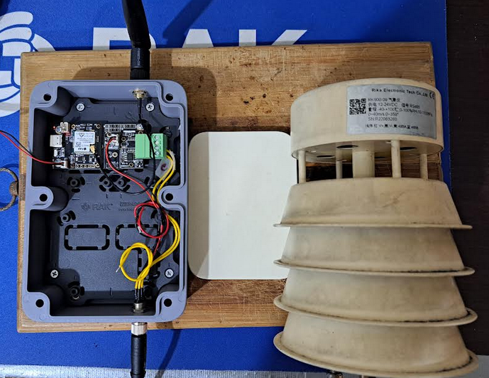
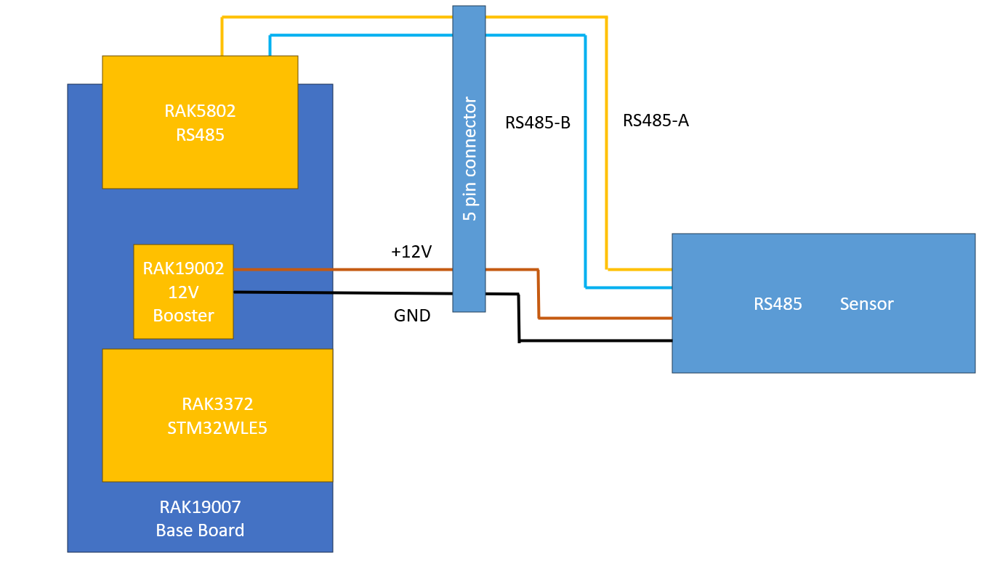

# RUI3-RS485-Wind-Sensor

&nbsp&nbsp&nbsp&nbsp&nbsp&nbsp

Example for a RS485 wind sensor using RAKwireless RUI3 on a RAK3172.

Works with the Rika RK900-09 sensor.    

# Components

----

## Rika RK900-09 Wind Sensor

### Rika RK900-09 [datasheet](./assets/RK900-09-miniature-ultrasonic-weather-Station-user-manual.pdf)

Sensor works by default with 9600 Baud

Rika RK900-09 Wind Sensor register setup
| Address | Multiplier | Register content                              |
| ------- | ---------- | --------------------------------------------- |
| 0x0000  | /100       | Wind Speed                                    | 
| 0x0001  | /1         | Wind Direction                                |
| 0x0002  | /10        | Temperature                                   | 
| 0x0003  | /10        | Humidity                                      |  
| 0x0004  | /10        | Barometric Pressure                           | 
| 0x0020  | *1         | Device address                                | 

----

## WisBlock modules & enclosure
- [RAK3172 Evaluation Board](https://docs.rakwireless.com/product-categories/wisduo/rak3172-evaluation-board/overview/) with
   - [RAK19007](https://docs.rakwireless.com/product-categories/wisblock/rak19007/overview) WisBlock Base Board
   - [RAK3372](https://docs.rakwireless.com/product-categories/wisblock/rak3372/overview) WisBlock Core module with STM32WLE5
- [RAK5802-M](https://docs.rakwireless.com/product-categories/wisblock/rak5802/overview) WisBlock RS485 module (modified variant)
- [RAK19002](https://docs.rakwireless.com/product-categories/wisblock/rak19002/overview) WisBlock 12V booster for supply of RS485 sensor (max 12V / 80mA)
- [Unify Enclosure 150x100x45](https://store.rakwireless.com/products/unify-enclosure-ip67-150x100x45mm-with-pre-mounted-m8-5-pin-and-rp-sma-antenna-ip-rated-connectors)

----

# Assembly

Assembly is done with the "standard" mounting plate of the Unify Enclosure.    
Sensor connection is done with the 5-pin IP65 connector of the Unify Enclosure. Antenna used is [Blade Antenna](https://docs.rakwireless.com/Product-Categories/Accessories/RAKARJ16/Overview/) with 2.3 dBi gain.

#### ⚠️ IMPORTANT ⚠️    
RAK19002 12V booster _**must**_ be installed in the Sensor Slot B    

#### ⚠️ INFO ⚠️  
A permanent power supply will be required due to the power consumption of the Wind Sensor. This is not yet implemented in the setup.

----

# Modbus Wiring diagram

----

# Firmware

Firmware is based on [RUI3-RAK5802-Modbus-Master](https://github.com/RAKWireless/RUI3-Best-Practice/tree/main/ModBus/RUI3-RAK5802-Modbus-Master) with adjustements for the used RS485 sensor.

----

## Custom AT commands

Send interval of the sensor values can be set with a custom AT command. Interval time is set in _**seconds**_

_**`ATC+SENDINT?`**_ Command definition
> ATC+SENDINT,: Set/Get the interval sending time values in seconds 0 = off, max 2,147,483 seconds    
OK

_**`ATC+SENDINT=?`**_ Get current send interval in seconds
> ATC+SENDINT=3600    
OK

_**`ATC+SENDINT=3600`**_ Get current send interval to 3600 seconds == 1 hour
> ATC+SENDINT=3600    
OK

----
----

# LoRa® is a registered trademark or service mark of Semtech Corporation or its affiliates. 

# LoRaWAN® is a licensed mark.

----
----
